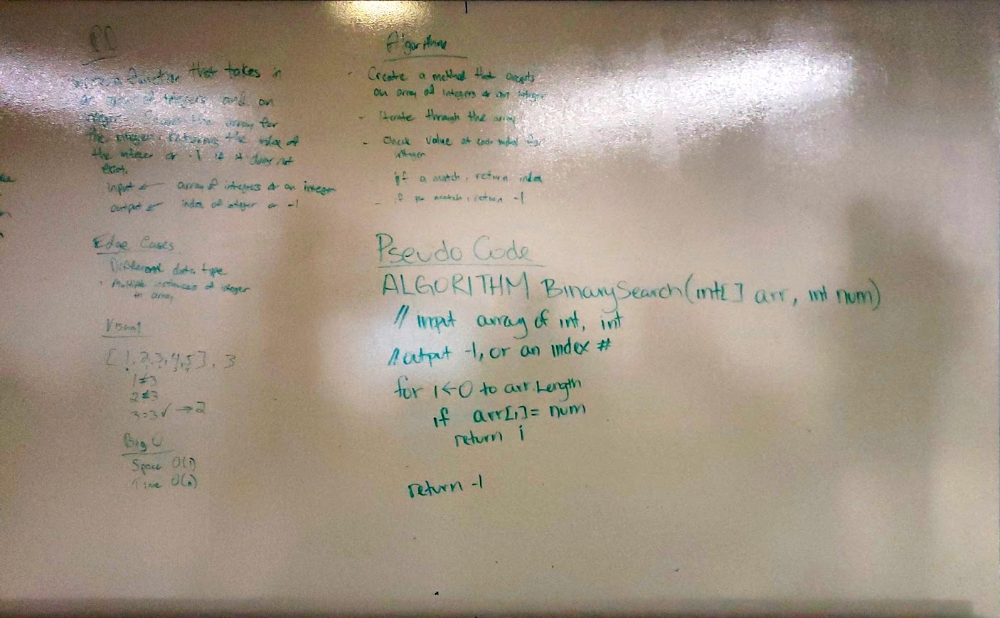

# Find the Height of a Binary Tree

## Challenge
Given a Node root, find the height of it's binary tree.

## Approach & Efficiency
- Space and Time:
	- Time: O(n) - We step through the entire tree.
	- Space: O(H) - We use the stack, so worst case, the space we need is the height of the tree.
- Approach:
	- Using recursion, set the height equal to a method taking the node and the current height. 
	- Inside that method, call our method, so long as the left and/or right child is not null.
	- Increment the height by one each time. 

## Solution

