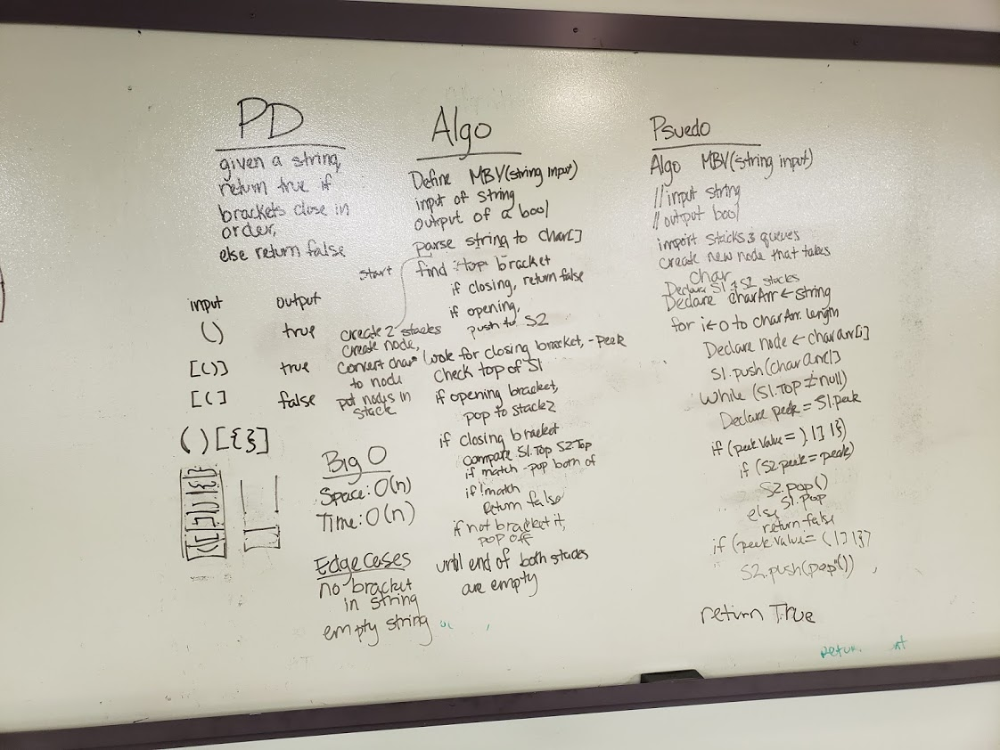

# MultiBracketValidation

## Challenge
Given a string containing brackets, check that all the brackets in the string are balanced. If they are, return true, if they are not, return false.  
Example: {}([]) returns true, {)} returns false.

## Approach and Efficiency
- Space and Time:
	- Time: O(n) - Because we handle each item in the string, our time is O(n)
	- Space: O(n) - We create a stack and an array with the given string.
- Approach:
	- Convert the string to character array
	- push each item of the array into a stack
	- create a helperStack
	- If the Top of the stack is a closing bracket, compare it to the helper stack. If the helperStack's top contains the corresponding bracket, pop both off and continue, return false
	- If the Top of the stack is an opening bracket, pop it off and push it to our helperStack.
	- Else, pop the top off.
	- Continue until the stack is empty. If there is anything left in the helperStack when the stack is empty, return false. Else return true.

##Solution
