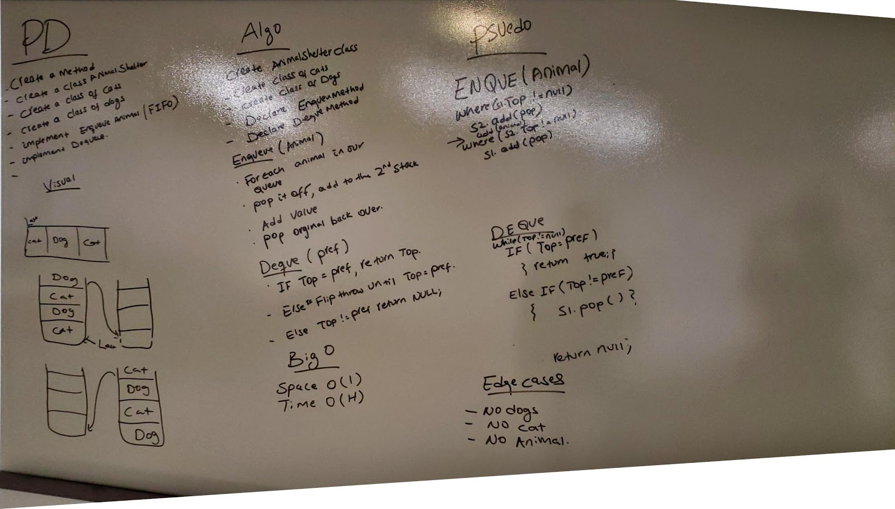

# FIFO Animal Shelter

## Challenge:
Create classes Animal and AnimalShelter. AnimalShelter should have the ability to enqueue new animals (cats and dogs), and the ability to Dequeue adopted pets. The Dequeue method should take an argument of the preferred pet type, and return that pet, leaving the rest of the queue intact. If that animal type is not in the queue, return null

## Efficiency and Approach
- Enqueue
	- Time: O(1) - We simply add it to the end of the queue
	- Space: O(1) - We are not creating anything new
- Dequeue
	- Time: O(n) - Worst case scenario we must go through the entire queue
	- Space: O(1) - we are not creating anything new, just movign things around

- Approach
	- Enqueue works exactly like a normal queue's Enqueue.
	- To Dequeue, we check the front of the queue against the input preference, if it matches, we remove that animal and return that animal, setting Front to Front.Next. If it does not mach, we dequeue the front, and enqueue it into a new queue. This continues until the front does match the preferred animal. Then the new shelter is attached back onto the front of the original animal shelter.

## Solution 
