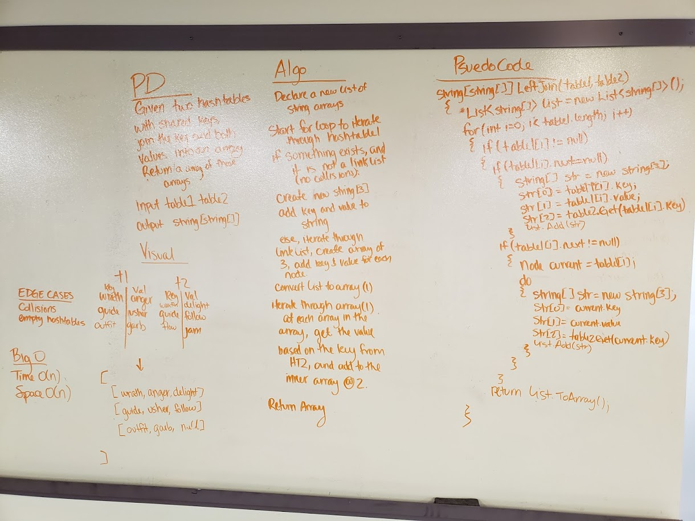

# Left Join

## Challenge
Write a method that LEFT JOINs two hashmaps into a single data structure.
- The first parameter is a hashmap that has word strings as keys, and a synonym of the key as values.
- The second parameter is a hashmap that has word strings as keys, and antonyms of the key as values.
Combine the key and corresponding values (if they exist) into a new data structure according to LEFT JOIN logic.
- LEFT JOIN means all the values in the first hashmap are returned, and if values exist in the “right” hashmap, they are appended to the result row. If no values exist in the right hashmap, then some flavor of NULL should be appended to the result row.

## Approach and Efficiency
- Efficiency:
	- Space: O(n) We create a new string array for each key in the left hashtable, and then add the values of the key from the left and right hashtables. 
	- Time: O(n) We iterate through the entire right hashtable.
- Approach:
	- Iterate through the first hashtable's array. If a key value pair exists at that index, create a new string array with a length of three.
	- In the first index of the new array, add the key of the key value pair. At the second index of the array, add the value of that key value pair. In the third index of the array, GET the value of the key from the second hashtable. It might be null. That's okay.
	- In case of collisions, go through the entire linklist and add each node.
	- Add the string to the list.
	- Return the list.

## Solution:

