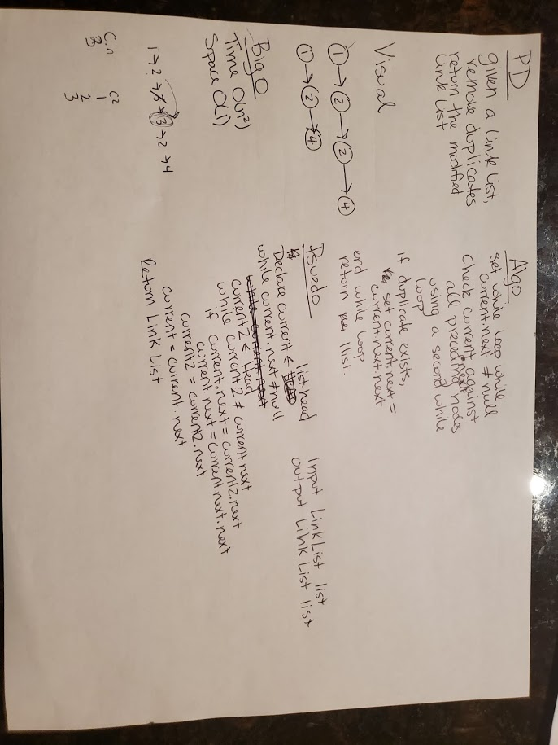

# Remove Duplcates from a Linked List 

## Challenge
Given a link list, remove all duplicates from the link list, without creating a new link list. Return the altered link list.

## Approach & Efficiency
- Space and Time:
	- Time: O(n^2) - To check for duplicates, we use a nested while loop, which needs a time of O(n^2)
	- Space: O(1) - We do not create anything new
- Approach:
	- While iterating through the link list, create a second current, C2, and set it equal to the head. Start another while loop, while current.next != C2. Check if the value of C2 equals current.next. If it does, skip over current.next. 
	- Set c2 to equal c2.next
	- Set current to equal current.next
	- return the link list.

## Solution

