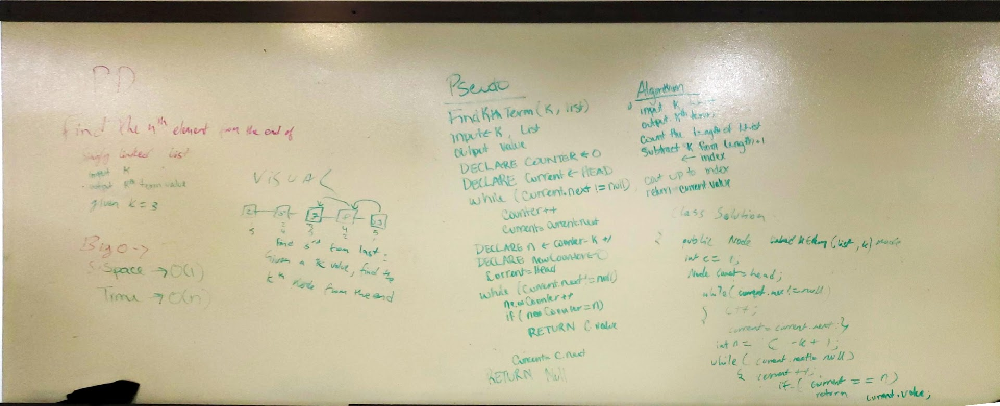
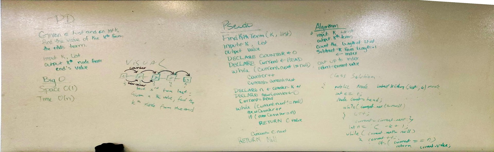

# Kth from the End

## Challenge
Given a Link List, list, and an integer, k, return the value of the node kth from the end.

##Approach and Efficiency
- Space and Time:
	- Time: O(n) - We run through two while loops, first to count the loop, then to find the node, so our time is O(n) 
	- Space: O(1) - We do not create anything, we simply run through our array, so our space is O(1)
- Approach:
	- First we run a while loop to run through our Linked List, counting each node
	- Then we calculate n, which is counter MINUS k PLUS 1
	- Then we run another while loop, counting each node until we get to n
	- We return the value of that node.
	- If k is out of bounds of the list, we return -1

##Solution

