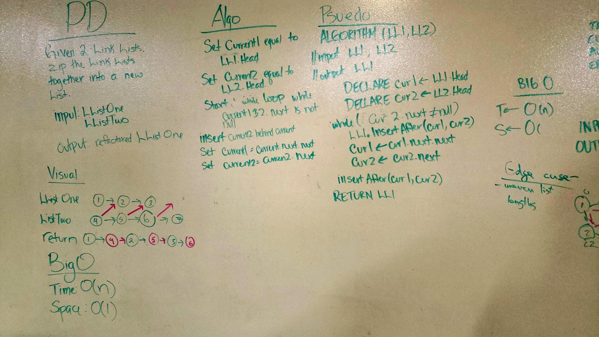

# Link List Merge

## Challenge
Given two link lists, zip them together into the first link list, and return that first link list. 

## Approach and Efficiency
- Space and Time:
	- Time: O(n) - We run through the entire link list, giving us O(n)
	- Space: O(1) - We do not create anything new.
- Approach:
	- Set Current equal to Head for both lists
	- Run a while loop while listOne.Current.Next is not null
		- Insert the current value for the second list into the first list using the InsertAfter Method
		- Set forward in the array
	- If list two was longer than list one, run another while loop
	- Append the next node in list two to the end of list one
	-Return list One

##Solution

