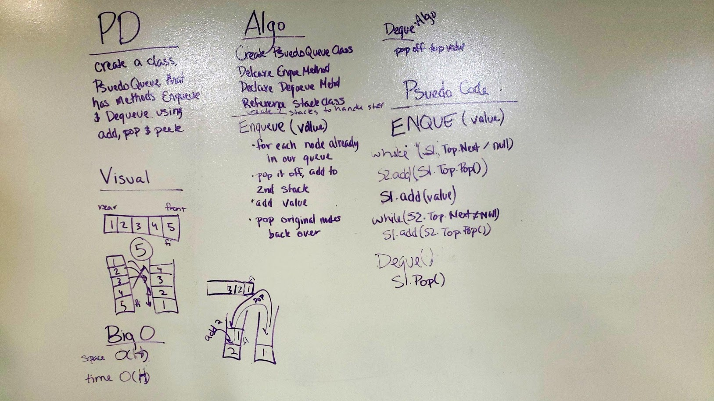

# Queue With Stacks.
## Challenge
Create a brand new PseudoQueue class. Do not use an existing Queue. Instead, this PseudoQueue class will implement the standard queue interface, but will internally only utilize 2 Stack objects. Ensure that you create your class with the following methods:  

- enqueue(value) which inserts value into the PseudoQueue, using a first-in, first-out approach.  
- dequeue() which extracts a value from the PseudoQueue, using a first-in, first-out approach.  
The Stack instances have only push, pop, and peek methods. You should use your own Stack implementation. Instantiate these Stack objects in your PseudoQueue constructor.  

## Approach and Efficiency
- Space and Time:
	- Enqueue 
		- Time: O(h) - We run through the entire stack, so Big O is determined by the height of the "stack"
		- Space: O(1) - We do not create anything new of any signifigance. We don't create a new stack or queue, but we do move things into empty stacks.
	- Dequeue
		- Time: O(1) - We do not run any loops
		- Space: O(1) - We do not create anything new.
- Approach:
	- When Enqueueing, we pop each Node off the "stack" and then push them onto our holder stack.
	- When there is nothing left in our "stack" we push our new value into the stack.
	- Then we pop each node off the holder stack, and push them back onto our "stack"
	- This way we maintain our order of FIFO
	- Because we keep our FIFO order when Enqueueing, to Dequeue we simply call the pop method. 

##Solution
