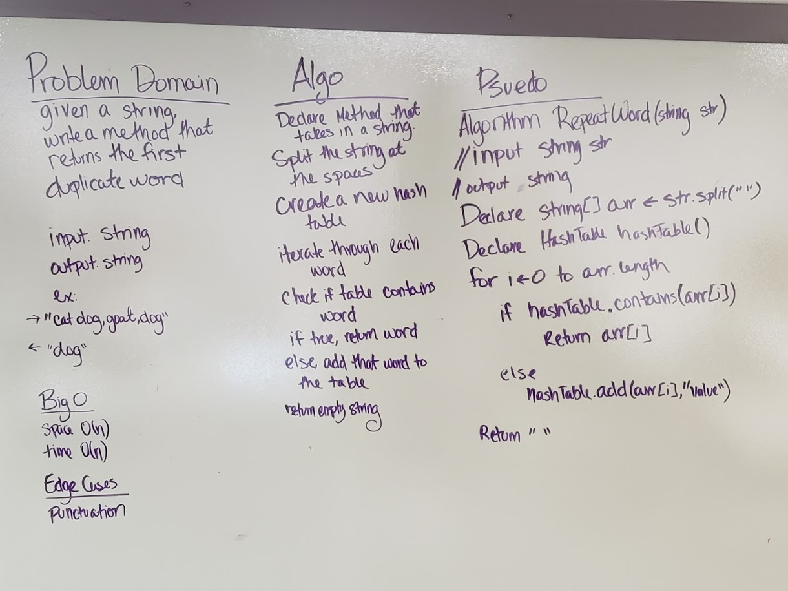

# Repeated Word

## Challenge
Write a method that takes in a string, and returns the first duplicated word.

## Approach and Efficiency 
- Efficiency
	- Space: O(n) - Because we have to convert are string to an array, we have a space of O(n)
	- Time: O(n) - Because we potentially have to iterate through our entire array, we have a time of O(n)
- Approach
	- Convert string to an array, breaking at spaces and other puncuation
	- Instanciate a Hashtable
	- Iterate through the array
	- At each indices, check if the hashtable contains the index as a key.
	- If if it does, return that string
	- Else, add the string to the hash table
	- If no repeats are found, return an empty string

## Solution

