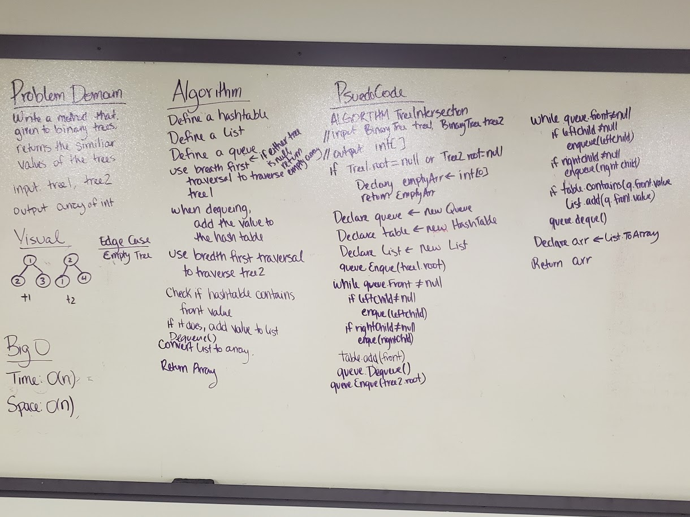

# Tree Intersection

## Challenge
Write a function called tree_intersection that takes two binary tree parameters. Without utilizing any of the built-in library methods available to your language, return a set of values found in both trees.

## Approach and Efficiency
- Efficiency:
	- Space: O(n) We create a hashtable and an array that both potentially hold every value given from one tree.
	- Time: O(n) We use bredth first traversal, which gives us a time of O(n).
- Approach:
	- Use bredth first traversal to step through the first binary tree. Add each value in the tree to a hashtable.
	- Use bredth first traversal to step through the second binary tree. Check if the hashtable contains each value. If it does, add that value to a list.
	- Convert the list to an array and return it. 

## Solution:

